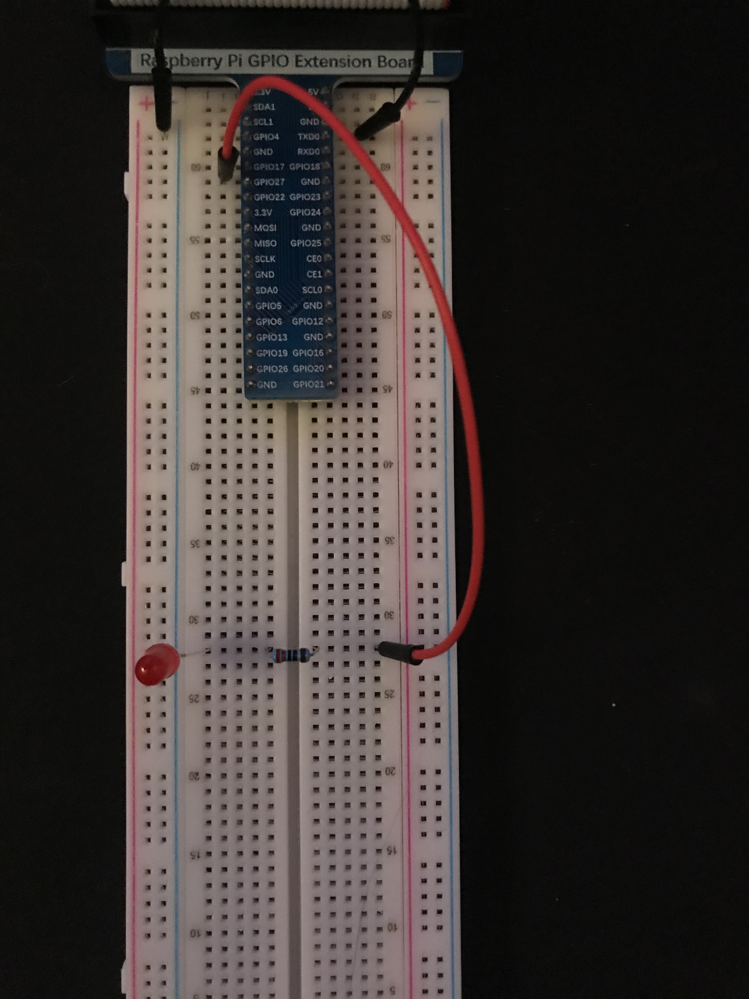
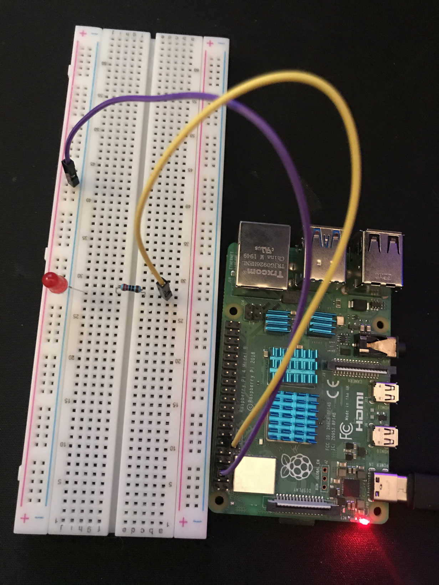

You will need:
	Anycolor led
	A 220 ohm resistor 
	A GPIO expansion board or 2x male to female jumper wires 

You should have one of the following circuits for this code to work correctly 

You can use a GPIO extension board like this 

Or you can use 2 male to female jumper wires 

